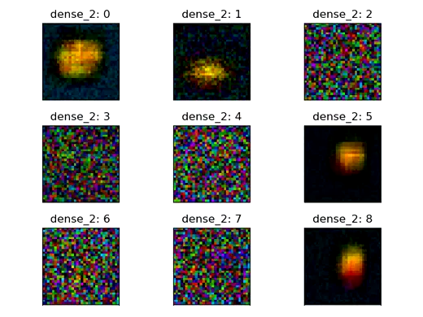
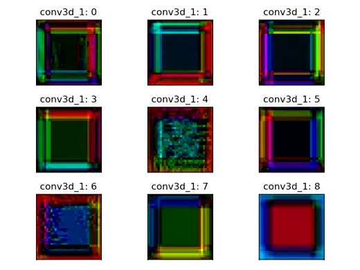

# speed-counting
This is a an experimental side project using a convolutional neural network to count competitive jump roping speed events.
I will be keeping track of progress on this repository and am open to any contributions.

This project requires Python 3+ and the following packages:

-Keras

-Tensorflow

-Numpy

-OpenCV

-Matplotlib

Currently there are two implementations which can be found in `train_video.py` and `train_flow.py`

`train_video.py` trains the model using the RGB pixel values from the videos

`train_flow.py` trains the model by first calculating a vector field of the motion in the video using the Lucas-Kanade method of optical flow

Further testing is needed to see which method is better or if it is viable to combine them together for a multi-input network.

By optimizing the input space with respect to a specific layer's activation we can visualize what each 3D convolution kernel is looking for:

These figures can be generated using the `vis_video.py` script.

Here are some visualizations of kernels from the model trained on motion flow:

It's difficult to draw any conclusions until I have a more sufficient dataset and access to more powerful hardware.
