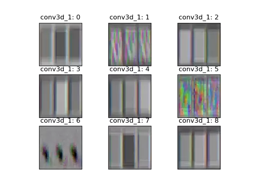
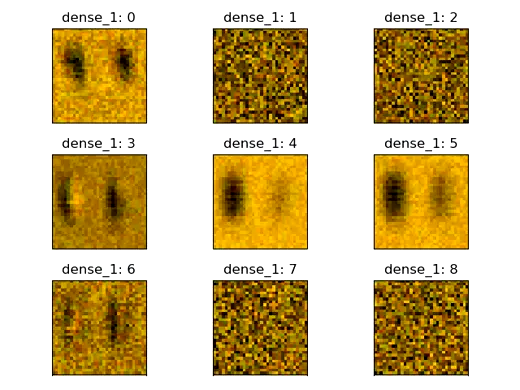

# speed-counting
This is a an experimental side project using a convolutional neural network to count competitive jump roping speed events.
I will be keeping track of progress on this repository and am open to any contributions.

This project requires Python 3+ and the following packages:

-Keras

-Tensorflow

-Numpy

-OpenCV

-Matplotlib

Currently there are two implementations which can be found in `train_video.py` and `train_flow.py`

`train_video.py` trains the model using the RGB pixel values from the videos

`train_flow.py` trains the model by first calculating a vector field of the motion in the video using the Lucas-Kanade method of optical flow

Further testing is needed to see which method is better or if it is viable to combine them together for a multi-input network.

By optimizing the input space with respect to a specific layer's activation we can visualize what each 3D convolution kernel is looking for:

These figures can be generated using the `vis_video.py` script

My current interpretation for why the network has learned kernels with three "columns" is due to the fact that I am attempting to train the network to be left-right invariant. So when detecting a right footed jump where the jumper is directly facing the camera, the center column of the kernel is activated by that right foot and the right column of the kernel is activated by the left foot.  Left footed jumps would activate the center column and the left column.  However if we apply the same optimization when the model is trained on motion fields, the kernels are slightly different:

It's difficult to draw any conclusions until I have a more sufficient dataset and access to more powerful hardware.
